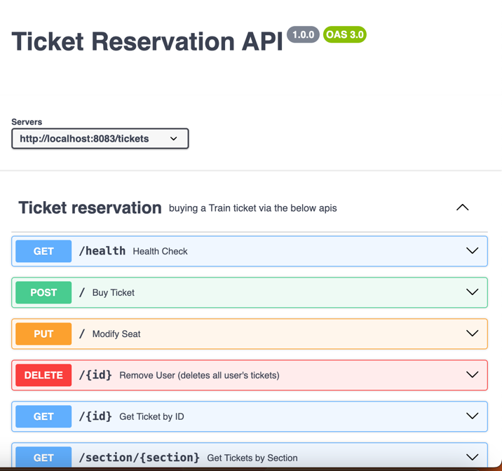

[Readme.md](Readme.md)# Getting Started

### Reference Documentation
For further reference, please consider the following sections:

* [Swagger Api Document](src/main/resources/swagger.yaml)
* [Test cases are included](src/test)
  * [ticketController](src/test/java/com/ticket/reservation/Controller/TicketControllerTest.java)
  * [ticketServiceImplementation](src/test/java/com/ticket/reservation/Service/Impl/TicketServiceImplTest.java)
### Guides
This Application designed in layered manner
1. swagger document for API specification
2. Controller to initate calls from external world
3. Models to represent the data to be stored/retrived/processed
4. Repository contains the query and functions to access the data
5. Service layer is a interface layer
6. Impl layer is the implementation of service interface
7. 
8. Buy ticket:
     curl --location 'localhost:8083/tickets' \
      --header 'Content-Type: application/json' \
      --data-raw '{
      "user":{"firstName": "rajesh",
      "lastName": "kamal",
      "email": "rajeshk486@gmail.com"
      },
      "from":"London",
      "to":"paris",
      "price":23,
      "section":"A"}'
9. Get ticket by id:
   curl --location --request GET 'localhost:8083/tickets/2' \
   --header 'Content-Type: application/json' \
   --data-raw '{
   "user":{"firstName": "rajesh",
   "lastName": "kamal",
   "email": "rajeshk486@gmail.com"
   },
   "from":"London",
   "to":"paris",
   "price":23,
   "section":"A"}'
for others please check the Swagger documentation